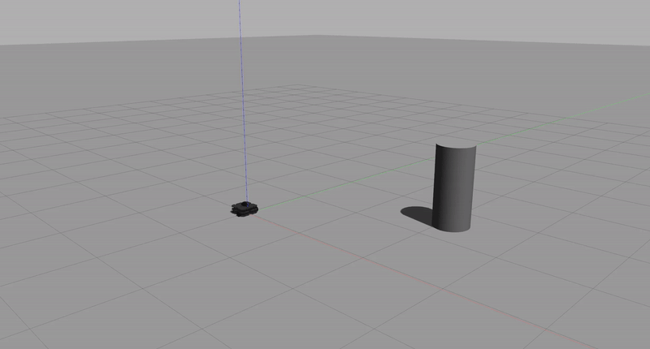

# Warmup Project

### Robot Behaviors
* **Driving in a Square**

  High Level Description: In order to direct the robot to drive in a square, I directed it to move forward for 5 seconds and make a 90 degree turn four times. I used the Twist message, specifically the linear x to move forward and the angular z to make turns.

  Code Explanation: I created a `DriveSquare` class, which has the following functions:
    * `turn` -  directs robot to turn 90 degrees by publishing a Twist message with z angular velocity of 0.5, waiting approximately pi seconds (since angular velocity is 1/2 and we want to travel pi/2), and then publishing the Twist message with the z angular velocity set back to 0

    * `go` - directs robot to drive forward for 5 seconds by publishing a Twist message with x linear velocity of 0.2, waiting 5 seconds, then publishing the Twist with the x linear velocity set back to 0

    * `run` - repeats the turn and go movements four times

  

* **Person Follower**

  High Level Description: In order to direct the robot to follow the person (or object), I used the LaserScan message data from the LiDAR to determine the current state of the robot and person and proportional control to determine how the robot should move. For the linear movement, I directed it to move at a constant velocity until it was less than 0.4m away from the person. For the angular movement, I used the current angle from the robot to the object (e.g. 0 degrees is directly in front of the robot, 90 degrees is directly to the left of the robot, etc.) as the process variable and 0 degrees as the desired set-point to determine the necessary angular velocity to turn the robot towards the person.

  Code Explanation: I created a `PersonFollower` class, which has the function `run` to run the node and the function `process_scan`, which:
    * if there is no object detected, publishes the Twist with 0 angular and linear velocity (so the robot does nothing).

    * if an object is detected, (1) retrieves the current angle by getting the min of the ranges and using the list index of the min as the angle, (2) sets the linear velocity to 0.3 by default or 0 if the object is within 0.4m of the robot, (3) determines the error signal as the difference between current angle and desired angle of 0 degrees, (4) sets the angular velocity using the error signal and a k_p of 0.01, and (5) publishes the Twist.

  

* **Wall Follower**

  High Level Description: In order to direct the robot to follow the wall, I used the LaserScan message data from the LiDAR to determine the current positions of the walls to the front and left of the robot. I used proportional control to set angular velocity so that if the robot strays of the path that is 0.5m away from the left wall it is following, then it will turn towards the path to try to get back on the path. I used the difference between the max range and the distance from the front of the robot to the wall to make the turns.

  Code Explanation: I created a `WallFollower` class with a `run` function to run the node and a `process_scan` function, which:
    * retrieves the distance to any object directly in front of or to the left of the robot from the LaserScan,

    * uses proportional control to control the angular velocity to try to stay on the path 0.5m from the left wall if there is no wall directly in front of the robot,

    * uses the distance from the front wall to determine angular velocity to make a right turn if there is a wall directly in front of the robot,

    * and publishes a constant linear velocity and the calculated angular velocity to the cmd_vel topic.

  

### Challenges

### Future Work

### Takeaways
