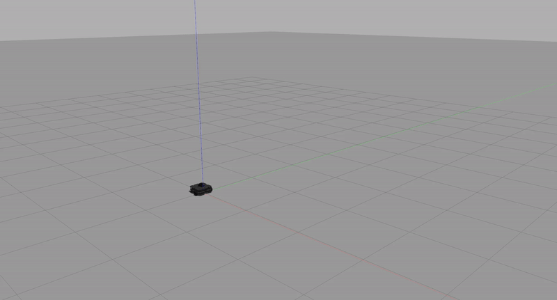

# Warmup Project

### Robot Behaviors
* **Driving in a Square**

  High Level Description: In order to direct the robot to drive in a square, I directed it to move forward for 5 seconds and make a 90 degree turn four times. I used the Twist message, specifically the linear x to move forward and the angular z to make turns.

  Code Explanation: I created a *DriveSquare* class, which has the following functions:
    * *turn* -  directs robot to turn 90 degrees by publishing a Twist message with z angular velocity of 0.5, waiting approximately pi seconds (since angular velocity is 1/2 and we want to travel pi/2), and then publishing the Twist message with the z angular velocity set back to 0

    * *go* - directs robot to drive forward for 5 seconds by publishing a Twist message with x linear velocity of 0.2, waiting 5 seconds, then publishing the Twist with the x linear velocity set back to 0

    * *run* - repeats the turn and go movements four times

  

* **Person Follower**
* **Wall Follower**

### Challenges

### Future Work

### Takeaways
